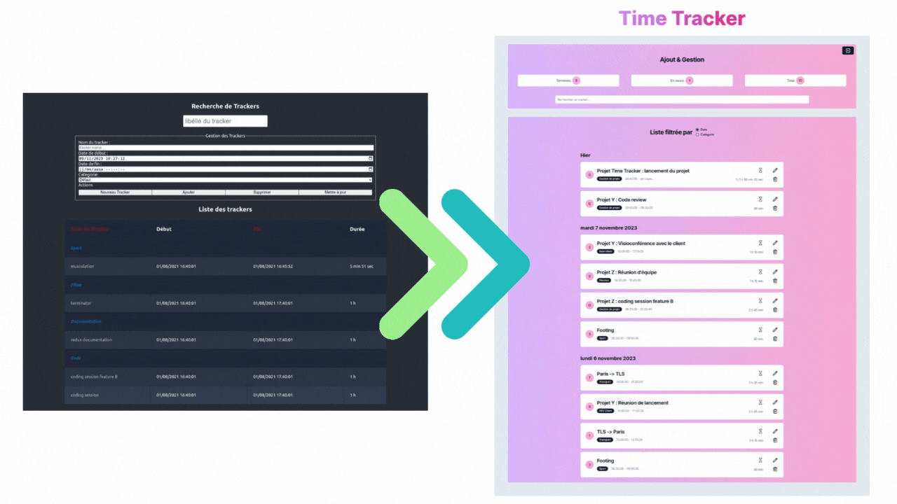

<div>
  <h1 align="center"><a href="https://time-tracker-phm31.vercel.app/">Time Tracker 📊</a></h1>
  <div align="center">
  <strong>
    Amélioration d'une application existante permettant de suivre vos tâches et le temps que vous y consacrez !
  </strong>
  </div><br />
  <a href="https://time-tracker-phm31.vercel.app/">
    
  </a> 
</div>

<hr />

<!-- prettier-ignore-start -->
![Next.js badge][next-badge] ![Taildwind CSS badge][taildwincss-badge]
<br />![GPL 3.0 License][license-badge] 
<!-- prettier-ignore-end -->

<br />

## <u>Objectif</u> : [Amélioration d'une application existante de Tracker de temps][Tracker de temps]

L'application existante est déployée sur [Vercel][vercel], et, est disponible [en cliquant ici >>][Tracker de temps].

L'accès au déploiement sur [Vercel][vercel] de la nouvelle version est disponible [en cliquant ici >>][Time Tracker].

Cette nouvelle application est un projet [Next.js][next] et les améliorations de cette nouvelle version concernent les points suivants :

- **Design** : en utilisant une librairie tierce pour remodeler le design de l'application.
- **UX** : en améliorant les fonctionnalistés lors de la création, suppression, mise à jour des données utilisateurs. Ajout de messages succincts qui s'affichent temporairement.
- **Filtrage des données** : en ajoutant la possibilité de filtrer les données utilisateurs par date, par catégorie, par état.
- **Stockage** : en utilisant le localStorage pour stocker les données utilisateurs

Les améliorations à venir sont définies dans les [Issues][issues].

## Languages and Tools:


<br />
<br />

## Démarrer l'application

Pour demarrer l'application, lancez le serveur de développement :

```bash
npm run dev
# or
yarn dev
# or
pnpm dev
```

Puis, ouvrez votre navigateur à l'adresse suivante : [http://localhost:3000][server local].

<br />

## Contributeurs

<table>
  <tr>
    <td align="center"><a href="https://ph-merrer.fr/" target="_blank"><br /><sub><b>Pierre-Henri Merrer</b></sub></a><br /><a href="https://github.com/Choukro/time-tracker" target="_blank" title="Code">💻</a> <a href="#objectif--amélioration-dune-application-existante" title="Documentation">📖</a>
  </tr>
  
</table>

<!-- prettier-ignore-start -->
[npm]: https://www.npmjs.com/
[next]: https://nextjs.org/docs/
[git]: https://git-scm.com/
[react-badge]: https://img.shields.io/badge/react-%2320232a.svg?style=for-the-badge&logo=react&logoColor=%2361DAFB
[taildwincss-badge]: https://img.shields.io/badge/tailwindcss-%2338B2AC.svg?style=for-the-badge&logo=tailwind-css&logoColor=white
[next-badge]: https://img.shields.io/badge/Next-black?style=for-the-badge&logo=next.js&logoColor=white
[license-badge]: https://img.shields.io/badge/license-GPL%2030%20License-blue.svg?style=flat-square
[vercel]: https://vercel.com/
[issues]: https://github.com/Choukro/time-tracker/issues/?target=_blank
[server local]:http://localhost:3000/
[Tracker de temps]:https://time-tracker-react-mastery-phm31.vercel.app/
[Time Tracker]:https://time-tracker-phm31.vercel.app/
<!-- prettier-ignore-end -->
